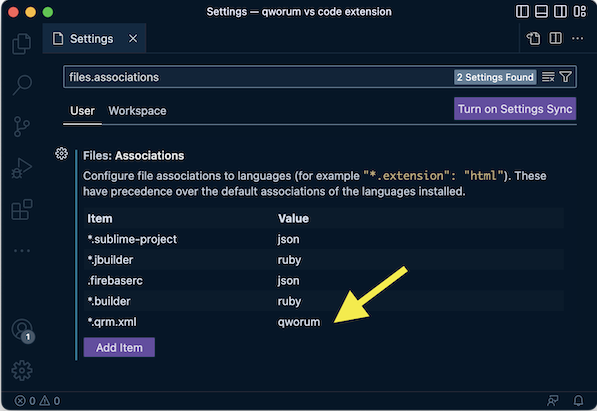

# Qworum for Visual Studio Code

Code snippets for [Qworum](https://qworum.net) scripts.

## How it works

This Visual Studio Code extension provides code snippets for all instructions and data types that are defined in the [Qworum specification](https://qworum.net/en/specification/v1/).

## Setup

After installing this VS Code extension, associate the `.qrm.xml` file extension with the Qworum script language.

To do so, go to `Preferences > Settings` and add the following key-value pair to `files.associations`:

∎
